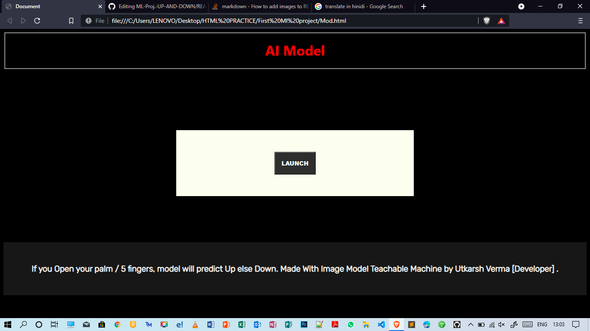

# Image - Model - Teachable - Machine
This is my first project with Image model teachable machine deploying on web/Github.


## How To Use?

```
Connect to Internet 

```

```
Run index.html file in your broowser

```
```
Press the button 'LAUNCH'

```
```
Read instruction given on Webpage!

```




## How to Make Own Model?
Go to this link
[Image Model Teachable Machine](https://teachablemachine.withgoogle.com/train/image)

& Train your Model
||  After training complete, click on export || Then Click on Upload.

## After upload complete 


```
Copy Tensorflow.js code and replace with my one
Happy Making ML.
```

## Contributing

Pull requests are welcome. For major changes, please open an issue first to discuss what you would like to change.
